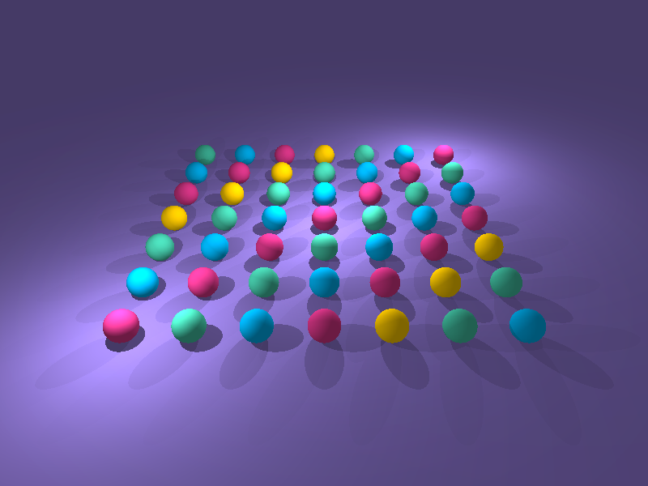
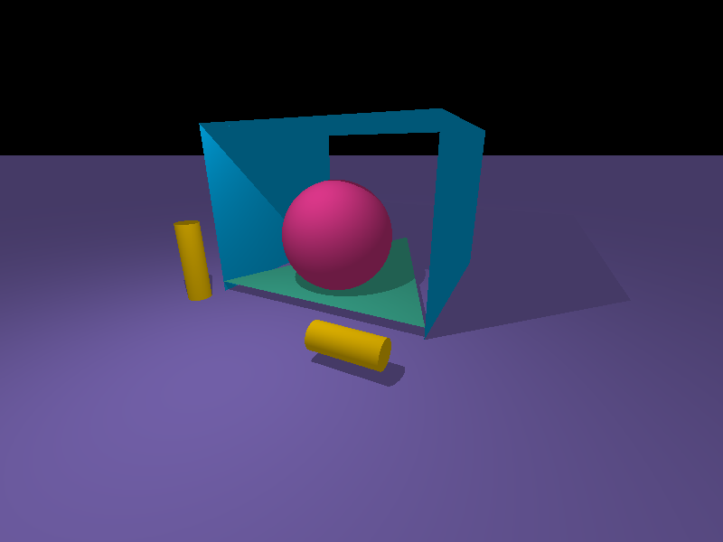
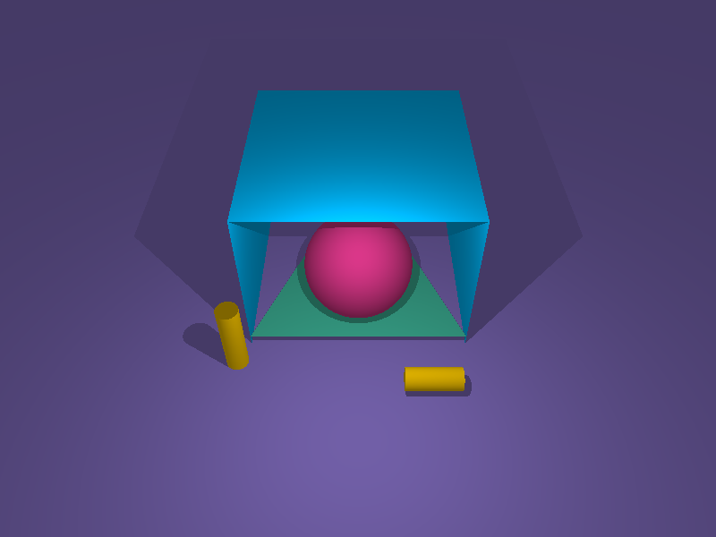
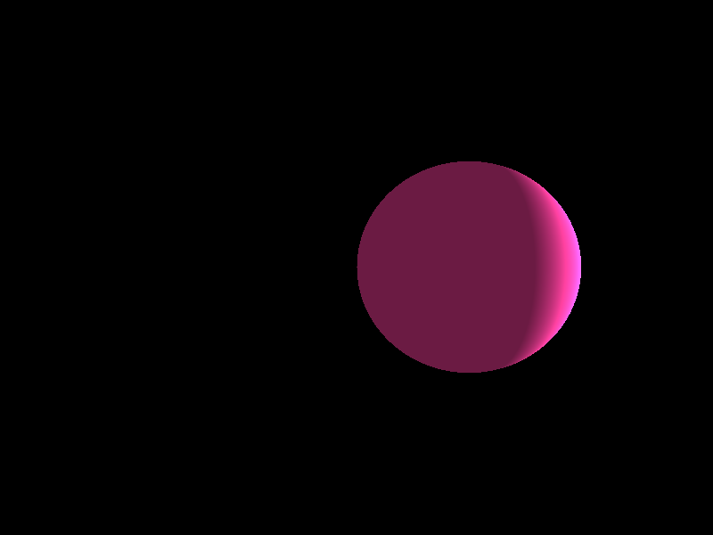
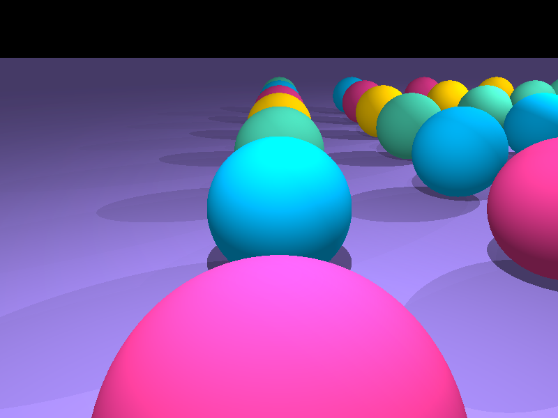
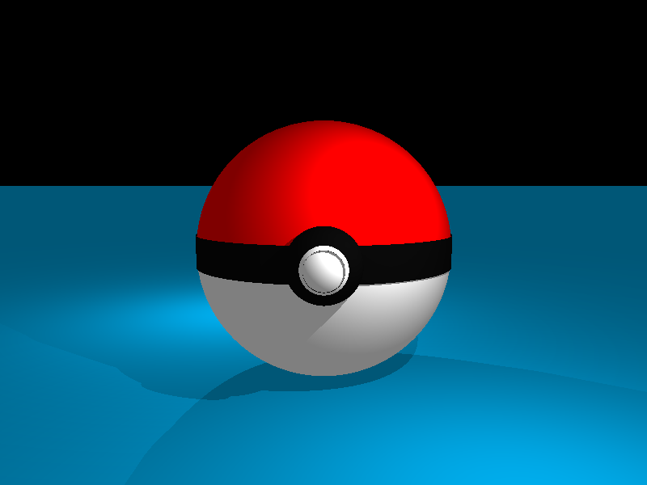
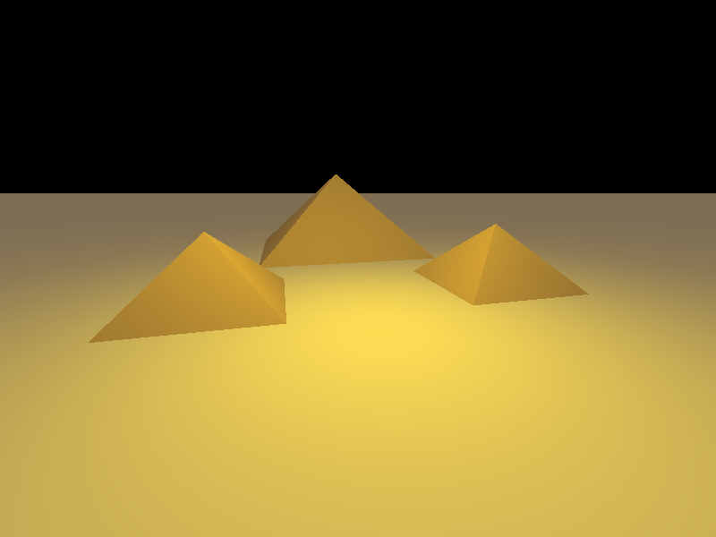

<h1 align="center">
	42cursus' miniRT
</h1>

<p align="center">
	<b><i>Development repo for 42cursus' miniRT project</i></b><br>
	For further information about 42cursus and its projects, please refer to <a href="https://github.com/appinha/42cursus"><b>42cursus repo</b></a>.
</p>

<p align="center">
	
	
	
	
	
</p>

<h3 align="center">
	<a href="#%EF%B8%8F-about">About</a>
	<span> · </span>
	<a href="#-index">Index</a>
	<span> · </span>
	<a href="#%EF%B8%8F-usage">Usage</a>
	<span> · </span>
	<a href="#-testing">Testing</a>
	<span> · </span>
	<a href="#-useful-links">Useful Links</a>
</h3>

---

## 🗣️ About

> _This project is an introduction to the beautiful world of Raytracing. Once completed you will be able to render simple Computer-Generated-Images and you will never be afraid of implementing mathematical formulas again._

For detailed information, refer to the [**subject of this project**](https://github.com/appinha/42cursus/tree/master/_PDFs).

	🚀 TLDR: this project consists of coding a simple RayTracer that runs with the miniLibX,
	a simple X-Window (X11R6) programming API in C.



## 📑 Index

`@root`

* [**📁 images:**](libft/) contains BMP image files generated by the program.
* [**📁 includes:**](includes/) contains the program's headers.
* [**📁 libft:**](libft/) contains the source code of the `libft` library, which is used in the program.
* [**📁 scenes:**](scenes/) contains `.rt` files, a file type that describes the scene to be rendered by the program.
* [**📁 srcs:**](libft/) contains the source code of the program.
* [**Makefile**](Makefile) - contains instructions for compiling the program and testing it.

_Note: program covers only mandatory requirements of the project's subject._

## 🛠️ Usage

### Requirements

The program is written in C language for **Linux** distributions and thus needs the **`clang` compiler** and some standard **C libraries** to run.

### Instructions

**1. Installing miniLibX**

First, to install all miniLibX requirements, run:

```shell
$ sudo apt-get install -y libxext-dev && sudo apt-get install -y libxrandr-dev && sudo apt-get install -y libx11-dev && sudo apt-get install -y libbsd-dev && sudo apt-get install -y libssl-dev
```

Then, we'll clone the miniLibX repository, checkout to the commit that is compatible with the program and compile the library:

```shell
$ cd ~ && git clone https://github.com/42Paris/minilibx-linux.git && cd minilibx-linux && git checkout acc9a87 && make
```

Finally, we'll create a directory for storing miniLibX manuals:

```shell
$ cd /usr/local/man/ && sudo mkdir man1
```

and copy the manuals to the directory we have just created:

```shell
$ sudo cp man/man1/* /usr/local/man/man1/ && sudo cp libmlx.a /usr/local/lib/ && sudo cp mlx.h /usr/local/include/
```

To show miniLibX 's manual page, run:

```shell
$ man mlx
```

_Note: To use the miniLibX in your project, you must add the following flags:_

```shell
-lbsd -lmlx -lXext -lX11
```

**2. Compiling the program**

To compile the program, run:

```shell
$ make
```

**3. Executing the program**

To execute the program on a **window**, run:

```shell
$ ./miniRT <scene-file.rt>
```

or, to generate a **BMP image file**, run:

```shell
$ ./miniRT <scene-file.rt> --save
```

## 📋 Testing

Files on the [scenes folder](scenes/) that begins with a numeral are scene files prepared for the evaluation of the project. You can run the program with such files as argument to check all rendering possibilities implemented in the program.

Below are all images generated from scenes of this folder, including some bonus scenes.

### The 5 Basic Shapes

|  |  |  | | 
| :-: | :-: | :-: | :-: | :-: |

### Translations and rotations / Multi-objects


|  |  |  | 
| :-: | :-: | :-: | :-: |

### Camera's position and direction

|  |  |  |
| :-: | :-: | :-: |

### Brightness & Shadows

|  |  |  |
| :-: | :-: | :-: |

### Multi-spots

|  |  |  |
| :-: | :-: | :-: |

### Bonus


|  |  |
| :-: | :-: |

|  |  |
| :-: | :-: |

_Many thanks to [@aroque](https://github.com/AdrianWR) for making these scene files (42 logo, pokeball and Giza pyramids) available_ :)

## 📌 Useful Links

* [42Paris/minilibx-linux](https://github.com/42Paris/minilibx-linux)
* [Tutorial on MiniLibX](https://harm-smits.github.io/42docs/libs/minilibx)
* [Ray Tracing in One Weekend by Peter Shirley](https://raytracing.github.io/books/RayTracingInOneWeekend.html)
* [Ray Tracing in One Weekend — The Book Series](https://raytracing.github.io/)
* [Useful links and info by lcouto et al](https://www.notion.so/miniRT-5f6fcdf6d05e4742b6c38f0588f12436)
